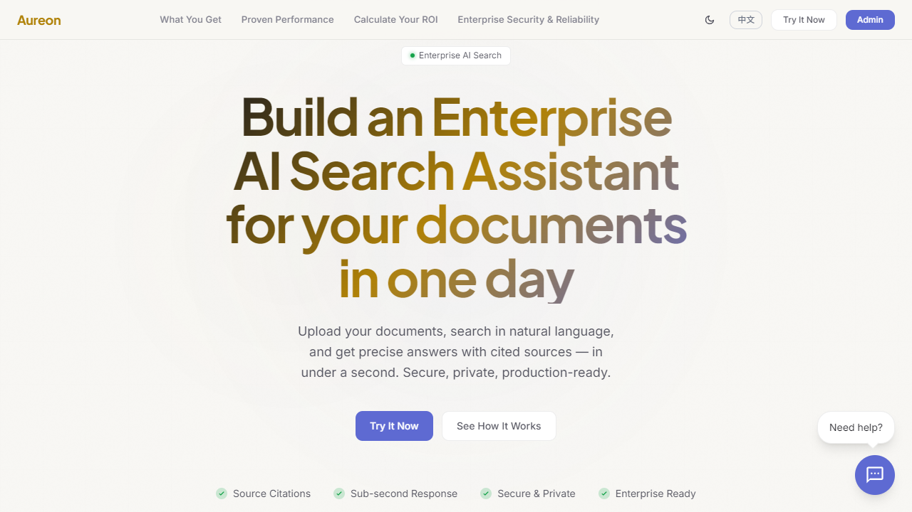
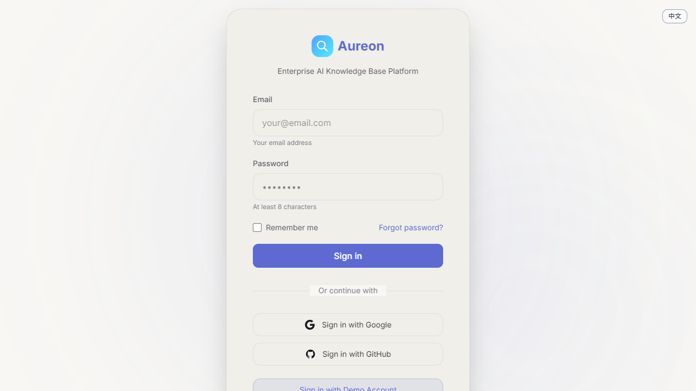
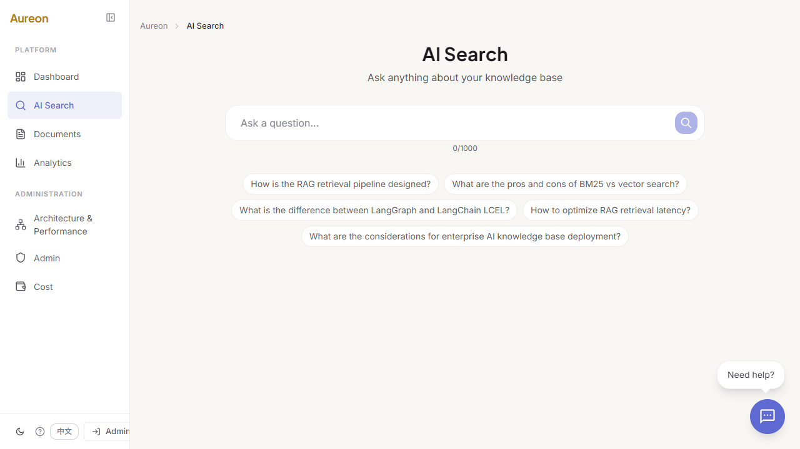

# Aureon

Production-ready enterprise AI knowledge base platform. Upload documents, search in natural language, and get cited answers in under a second.

[](https://github.com/Yum-wu/Aureon/actions)
[](LICENSE)
[](https://www.python.org/)
[](https://fastapi.tiangolo.com/)
[](https://react.dev/)
[](https://qdrant.tech/)
[](https://github.com/Yum-wu/Aureon/actions)

**Other languages**: [中文](README.zh-CN.md)
**Live demo**: [aureon-production-659a.up.railway.app](https://aureon-production-659a.up.railway.app)
**Demo account**: `admin / Aureon`
**Screenshots**: [landing](screenshots/en-landing-page.png) | [login](screenshots/en-login-page.png) | [search](screenshots/en-search-page.png)

## What It Shows

- Enterprise AI search with cited answers
- Hybrid retrieval with sparse + dense search
- Role-based access, audit logging, PII masking, and guardrails
- Real UI, real demo flow, real deployment
- Verified by `1011` backend tests and live production deployment

## Why It Is Credible

- `Recall@5`: `100%`
- `TTFT P50`: `590ms`
- `Cost/query`: `$0.0003`
- `Negative detection`: `92.3%`
- `PII leakage`: `1.000`

## Screenshots

| Landing | Login | Search |
|---|---|---|
|  |  |  |

## Core Flows

- Search docs with citations
- Upload and index documents
- Use the in-app navigation after sign-in
- Switch between Chinese and English

## Stack

- Backend: FastAPI, LangGraph, LangChain, Qdrant, Redis
- Frontend: React 19, TypeScript, Vite, Tailwind CSS 4
- Ops: Docker, GitHub Actions, Railway

## Quick Start

```bash
git clone https://github.com/Yum-wu/Aureon.git
cd Aureon
cp backend/.env.example backend/.env
cd backend
pip install -r requirements.txt
uvicorn app.main:app --reload --port 8000
```

```bash
npm install
npm run dev
```

## Docs

- [docs/architecture.md](docs/architecture.md) - public architecture overview
- [SECURITY.md](SECURITY.md) - security reporting

## Support

- Bug reports: [GitHub Issues](https://github.com/Yum-wu/Aureon/issues)
- Feature requests: [GitHub Discussions](https://github.com/Yum-wu/Aureon/discussions)

## License

[MIT](LICENSE) (c) 2024-2026 Yum-wu
