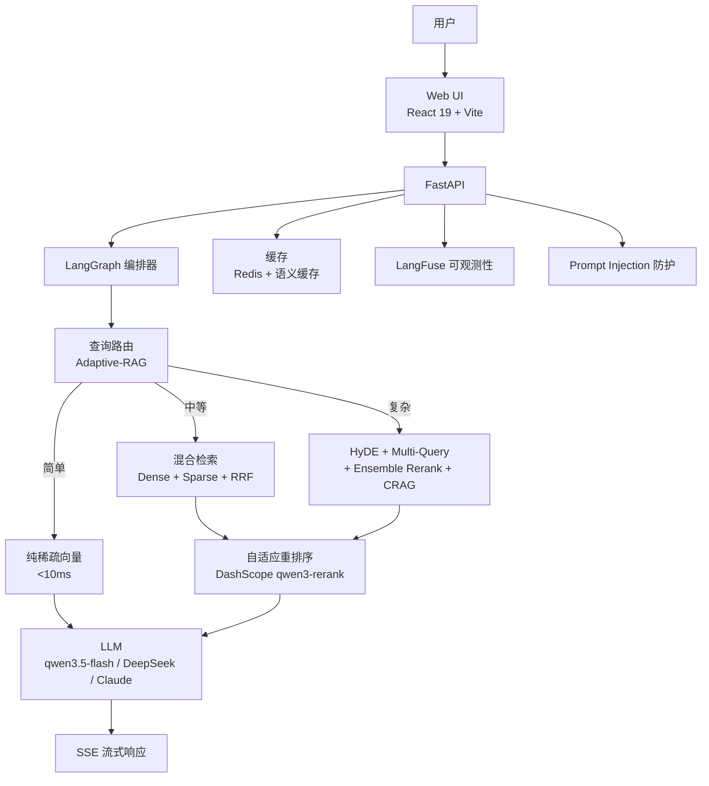

# Aureon

生产级企业 AI 搜索和知识智能平台。

[](https://github.com/Yum-wu/Aureon/actions)
[](LICENSE)
[](https://www.python.org/)
[](https://fastapi.tiangolo.com/)
[](https://react.dev/)
[](https://qdrant.tech/)
[](https://www.docker.com/)
[](https://github.com/Yum-wu/Aureon/actions)

**其他语言**: [English](README.md) | [在线演示](https://aureon-production-659a.up.railway.app)

---

## 目录

- [为什么选择 Aureon？](#为什么选择-aureon)
- [功能特性](#功能特性)
- [性能指标](#性能指标)
- [架构](#架构)
- [快速开始](#快速开始)
- [使用示例](#使用示例)
- [截图](#截图)
- [安全](#安全)
- [文档](#文档)
- [更新日志](#更新日志)
- [路线图](#路线图)
- [贡献指南](#贡献指南)
- [支持](#支持)
- [维护者](#维护者)
- [许可证](#许可证)

## 为什么选择 Aureon？

| | 传统 RAG | 纯向量搜索 | **Aureon** |
|---|---|---|---|
| Recall@5 | ~84% | ~90% | **100%** |
| 查询路由 | 一刀切 | 一刀切 | **自适应（简单/中等/复杂）** |
| 重排序 | 静态阈值 | 无 | **按复杂度动态调整** |
| 负例检测 | 无 | 无 | **92.3% 准确率** |
| TTFT P50 | ~2-5s | ~1-2s | **590ms** |
| 每次查询成本 | ~$0.01 | ~$0.005 | **$0.0003** |

Aureon 结合了 **Adaptive-RAG 查询路由**、**Qdrant 原生稀疏+稠密混合搜索**、**轻量 CRAG** 和 **动态重排序**，以极低的成本提供企业级检索质量。

## 功能特性

- **企业级 AI 搜索** — 流式回答，渐进式引用
- **混合检索** — Qdrant 原生 sparse + dense 混合搜索（RRF fusion），MRR 提升 100%
- **自适应查询路由** — Adaptive-RAG 按复杂度分配策略（简单 → 纯稀疏，中等 → 混合，复杂 → HyDE + Multi-Query + CRAG）
- **轻量 CRAG** — 基于 Embedding 的检索评估，延迟仅 ~50ms（vs LLM CRAG ~1s）
- **动态重排序** — 按查询复杂度调整阈值（simple: 0.55, medium: 0.40, complex: 0.30）
- **语义缓存** — 双层缓存（Exact + Semantic），延迟降低 97%
- **负例检测** — 92.3% 准确率拒绝超出范围查询
- **安全加固** — JWT/RBAC、Fernet 加密、Prompt Injection 检测、PII 脱敏、Dev 模式硬阻断
- **多租户隔离** — JWT 签名验证 tenant_id（纯 ASGI 中间件，不信任客户端 header）
- **文档管理** — 上传、自动索引、预览、来源管理
- **LangFuse 可观测性** — 全链路追踪（LLM → Tool → Chain → RAG）
- **系统仪表盘** — 实时指标、健康监控、使用分析
- **企业后台** — 工作区管理、RBAC、审计日志
- **Feature Flags** — 灰度发布、生命周期管理
- **成本治理** — 工作区级成本追踪、预算管理
- **1000+ 文档规模** — HNSW 量化 + 标量量化，内存减少 75%
- **793 测试** — 全面测试覆盖 + DeepEval 质量门禁

## 性能指标

### RAG 质量（R19 Benchmark，2026-06-17）

| 指标 | 值 | 目标 | 状态 |
|------|-----|------|------|
| 忠实度 | **0.976** | >=0.70 | 通过 |
| 答案相关性 | **0.976** | >=0.75 | 通过 |
| 幻觉率 | **0.067** | <=0.20 | 通过 |
| 负例检测 | **92.3%** | >=80% | 通过 |
| PII 泄露 | **1.000** | >=0.90 | 通过 |
| 毒性 | **1.000** | >=0.90 | 通过 |
| MRR | **0.968** | >=0.85 | 通过 |
| 上下文精度 | **94.4%** | >=70% | 通过 |
| Recall@5 | **100.0%** | >=95% | 通过 |

### 延迟性能（50 条详细基准测试）

| 指标 | 值 | 目标 |
|------|-----|------|
| TTFT P50 | **590ms** | <=2000ms |
| TTFT P95 | 1,677ms | - |
| TPOT | **55.7ms/tok** | <=100ms/tok |
| E2E P50 | **856ms** | <=5000ms |
| 每次查询成本 | **$0.0003** | - |

## 架构



<details>
<summary>查看文本架构图</summary>

```
用户 → Web UI (React + Vite) → FastAPI → LangGraph 编排器
                                          ├── 查询路由 (Adaptive-RAG)
                                          ├── 混合检索 (Sparse + Dense + RRF)
                                          ├── 轻量 CRAG (embedding-based)
                                          ├── LLM (qwen3.5-flash / DeepSeek / Claude)
                                          ├── 缓存 (Redis + 语义缓存)
                                          ├── 自适应重排序 (DashScope qwen3-rerank)
                                          ├── LangFuse 可观测性
                                          ├── Prompt Injection 防护
                                          └── SSE 流式响应
```

</details>

## 快速开始

### 前置依赖

- **Python** 3.12+（见 [.python-version](.python-version)）
- **Node.js** 20+
- **Redis**（缓存必需）
- **Qdrant**（Cloud 或自托管，[免费额度可用](https://qdrant.tech/)）
- **DashScope API Key**（用于 LLM + Embedding + Reranker，[在此获取](https://dashscope.console.aliyun.com/)）

### 1. 克隆与配置

```bash
git clone https://github.com/Yum-wu/Aureon.git
cd Aureon

# 复制环境变量模板
cp backend/.env.example backend/.env
# 编辑 backend/.env 填入你的 API Key（见下方环境变量说明）
```

### 2. 后端

```bash
cd backend
pip install -r requirements.txt
uvicorn app.main:app --reload --port 8000
```

### 3. 前端

```bash
npm install && npm run dev
```

### 4. Docker（生产环境推荐）

```bash
docker-compose up
```

### 环境变量

`backend/.env` 中的关键变量（完整列表见 [.env.example](backend/.env.example)）：

| 变量 | 必需 | 说明 |
|------|------|------|
| `LLM_API_KEY` | 是 | DashScope LLM API Key |
| `DASHSCOPE_API_KEY` | 是 | DashScope Embedding API Key |
| `QDRANT_URL` | 是 | Qdrant 实例 URL |
| `QDRANT_API_KEY` | 远程时必需 | Qdrant API Key |
| `REDIS_URL` | 是 | Redis 连接 URL |
| `API_AUTH_KEY` | 生产环境 | API 认证密钥 |
| `JWT_SECRET` | SSO/RBAC | JWT 签名密钥 |
| `VECTOR_BACKEND` | 否 | `qdrant`（默认）或 `chroma` |
| `SKIP_LOCAL_EMBED` | 否 | `true` 使用纯 API Embedding（Docker 推荐） |

## 使用示例

### RAG 查询

```bash
# 简单查询
curl -X POST http://localhost:8000/api/rag/query \
  -H "Content-Type: application/json" \
  -d '{"query": "Aureon 是什么？"}'

# SSE 流式查询
curl -X POST http://localhost:8000/api/rag/query/stream \
  -H "Content-Type: application/json" \
  -d '{"query": "解释自适应 RAG 路由策略"}'
```

### Agent 对话

```bash
# RAG 增强的流式对话
curl -X POST http://localhost:8000/api/chat/enhanced/stream \
  -H "Content-Type: application/json" \
  -H "X-API-Key: your_api_key" \
  -d '{"message": "混合搜索是如何工作的？", "session_id": "demo"}'
```

### 上传与索引文档

```bash
# 上传文档并自动索引
curl -X POST http://localhost:8000/api/rag/upload \
  -H "X-API-Key: your_api_key" \
  -F "file=@document.pdf"
```

### 健康检查

```bash
curl http://localhost:8000/api/health
# {"status": "ok", ...}
```

## 截图

| 落地页 | 搜索页 |
|--------|--------|
|  |  |

## 安全

Aureon 实现了多层安全防护：

- **认证**：API Key（`X-API-Key` header）+ JWT/RBAC + Fernet 加密密钥
- **多租户隔离**：JWT 签名验证 `tenant_id`（纯 ASGI 中间件，不信任客户端 header）
- **Prompt Injection 检测**：`backend/app/rag/guardrails.py` 中的防护机制
- **PII 脱敏**：自动检测和脱敏个人身份信息
- **Dev 模式硬阻断**：生产平台启动时拒绝 `AUTH__ENVIRONMENT=dev` + RBAC 旁路阻断
- **CORS 白名单**：显式 header 白名单（不含 `*`）
- **容器安全**：非 root 用户（UID 1001）、Trivy 镜像扫描、pip-audit 依赖扫描
- **审计日志**：`user_id` 仅从已验证 JWT 提取（不信任客户端 header）

漏洞报告请参阅 [SECURITY.md](SECURITY.md)。

## 文档

- [系统架构](docs/architecture/system-overview.md)
- [基准测试与评估](docs/benchmarks/recall-evaluation.md)
- [Docker 部署](docs/deployment/docker-setup.md)
- [产品功能](docs/product/features.md)
- [ADR: Qdrant HNSW 量化](docs/adr/0001-qdrant-hnsw-quantization.md)
- [ADR: 稀疏向量](docs/adr/0002-qdrant-sparse-vectors.md)
- [ADR: Embedding 维度 1024](docs/adr/0003-embedding-dim-1024.md)
- [ADR: 轻量 CRAG](docs/adr/0004-lightweight-crag.md)
- [ADR: Adaptive-RAG 查询路由](docs/adr/0005-adaptive-rag-query-routing.md)

## 更新日志

查看 [GitHub Releases](https://github.com/Yum-wu/Aureon/releases) 获取版本历史和发布说明。

## 路线图

- [ ] 多语言文档支持（日语、韩语）
- [ ] GraphRAG 集成知识图谱查询
- [ ] 实时协作编辑
- [ ] 移动端响应式 PWA
- [ ] 插件系统（自定义工具和连接器）

查看 [GitHub Discussions](https://github.com/Yum-wu/Aureon/discussions) 了解功能请求和进展。

## 贡献指南

欢迎贡献！请遵循以下步骤：

1. **Fork** 本仓库
2. **创建** 功能分支（`git checkout -b feature/amazing-feature`）
3. **提交** 规范化消息（`feat: 添加新功能`）
4. **测试** — 运行 `cd backend && python -m pytest tests/ -v` 和 `npm test -- --run`
5. **Lint** — 运行 `cd backend && python -m ruff check .` 和 `npx eslint .`
6. **推送** 并创建 **Pull Request**

请确保：
- 793+ 后端测试全部通过
- 新代码包含类型注解（`def foo(x: int) -> str:`）
- 异步优先（`async def` + `asyncio`）
- 禁止裸 `except` — 至少 `logger.exception()`
- 使用 `structlog.get_logger(__name__)` 结构化日志

详见 [CONTRIBUTING.md](CONTRIBUTING.md)（如有）。

## 支持

- **Bug 报告**: [GitHub Issues](https://github.com/Yum-wu/Aureon/issues)
- **功能请求**: [GitHub Discussions](https://github.com/Yum-wu/Aureon/discussions)
- **安全漏洞**: 见 [SECURITY.md](SECURITY.md)

## 维护者

- [Yum-wu](https://github.com/Yum-wu) — 创建者 & 维护者

## 许可证

[MIT](LICENSE) (c) 2024-2026 Yum-wu
