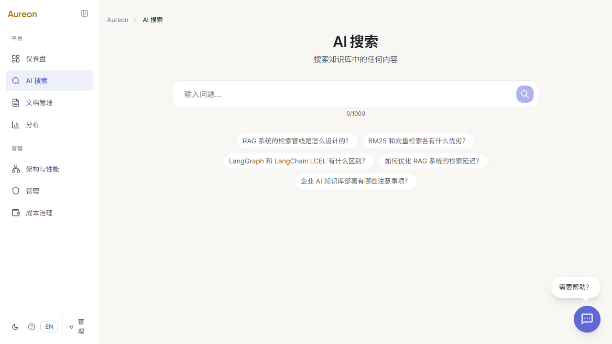

# Aureon

生产可用的企业级 AI 知识库平台。上传文档，用自然语言搜索，不到一秒即可获得带引用来源的答案。

[](https://github.com/Yum-wu/Aureon/actions)
[](LICENSE)
[](https://www.python.org/)
[](https://fastapi.tiangolo.com/)
[](https://react.dev/)
[](https://qdrant.tech/)
[](https://github.com/Yum-wu/Aureon/actions)

**其他语言**: [English](README.md)
**在线演示**: [aureon-production-659a.up.railway.app](https://aureon-production-659a.up.railway.app)
**演示账号**: `admin / Aureon`
**截图**: [首页](screenshots/landing-page.png) | [登录](screenshots/login-page.png) | [搜索](screenshots/zh-search-page.png)

## 它展示了什么

- 带引用来源的企业级 AI 搜索
- 稀疏 + 稠密混合检索
- RBAC、审计日志、PII 脱敏、Guardrails
- 真实 UI、真实演示、真实部署
- `958` 个后端测试验证

## 为什么可信

- `Recall@5`：`100%`
- `TTFT P50`：`590ms`
- `单次成本`：`$0.0003`
- `负例检测`：`92.3%`
- `PII 泄露`：`1.000`

## 截图

| 首页 | 登录 | 搜索 |
|---|---|---|
|  |  |  |

## 核心流程

- 搜索文档并返回引用
- 上传并索引文档
- 登录后使用应用内导航继续浏览
- 中英双语切换

## 技术栈

- 后端：FastAPI、LangGraph、LangChain、Qdrant、Redis
- 前端：React 19、TypeScript、Vite、Tailwind CSS 4
- 运维：Docker、GitHub Actions、Railway

## 快速开始

```bash
git clone https://github.com/Yum-wu/Aureon.git
cd Aureon
cp backend/.env.example backend/.env
cd backend
pip install -r requirements.txt
uvicorn app.main:app --reload --port 8000
```

```bash
npm install
npm run dev
```

## 文档

- [CLAUDE.md](CLAUDE.md) - 项目约定、结构、API 端点
- [CONTEXT.md](CONTEXT.md) - 领域术语、RAG 历史、MVP 边界
- [SECURITY.md](SECURITY.md) - 安全报告

## 支持

- Bug 报告: [GitHub Issues](https://github.com/Yum-wu/Aureon/issues)
- 功能请求: [GitHub Discussions](https://github.com/Yum-wu/Aureon/discussions)

## 许可证

[MIT](LICENSE) (c) 2024-2026 Yum-wu
