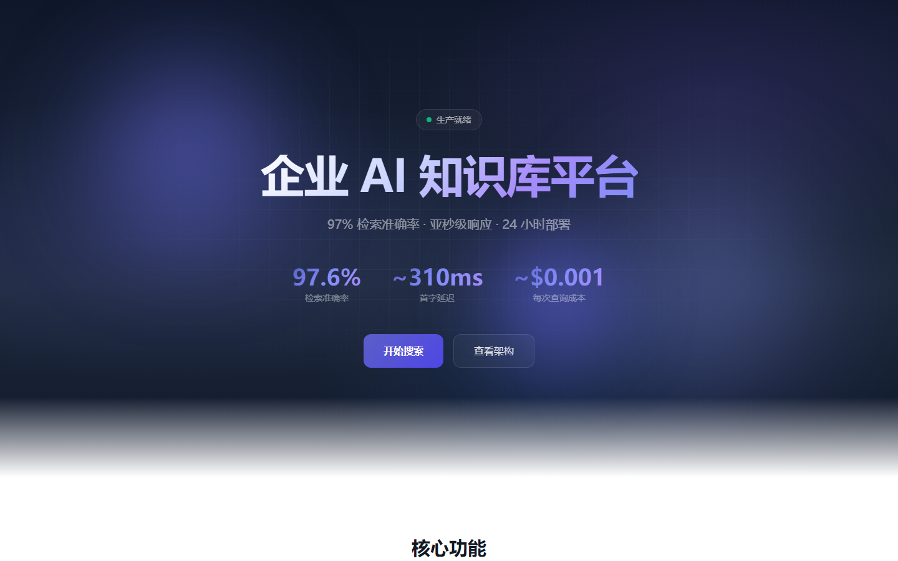
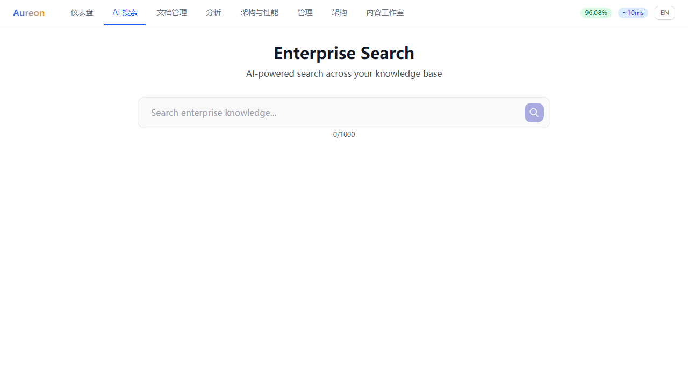

# Aureon — 企业级 AI 知识库平台

> 生产级企业 AI 搜索和知识智能平台。

[](https://github.com/Yum-wu/Aureon/actions)
[](LICENSE)

---

**English version**: [English](README.md)

## 性能指标

| 指标 | 值 |
|------|-----|
| Recall@3 (混合检索) | **96.5%** |
| 上下文精准度 (DeepEval) | **0.92+** |
| 忠实度 (DeepEval) | **0.967** |
| 负面检测 | **100%** |
| TTFT (流式响应) | **~310ms** |
| 检索延迟 | **~154ms** |
| 每次查询成本 | **$0.0003** |

## 功能特性

- **企业级 AI 搜索** — 流式回答，渐进式引用
- **混合检索** — BM25 关键词 + Dense 语义 (Qdrant) + 上下文压缩
- **RAG 自纠正** — CRAG 检索质量低时自动重写查询
- **语义缓存** — 双层缓存 (Exact + Semantic)，延迟降低 97%
- **自适应重排序** — Query-aware 策略选择，精度提升 22%
- **WebSocket 流式** — 双向实时通信，200+ 并发连接
- **安全加固** — API Key 认证、Prompt Injection 检测、Fernet 加密
- **文档管理** — 上传、自动索引、预览、来源管理
- **系统仪表盘** — 实时指标、健康监控、使用分析
- **数据分析** — 延迟、Token 使用、缓存性能、查询分布
- **企业后台** — 工作区管理、RBAC、审计日志
- **750+ 后端测试** — 全面测试覆盖

## 架构

```
用户 → Web UI (React + Vite) → FastAPI → LangGraph 编排器
                                          ├── 意图分类器
                                          ├── 混合检索 (BM25 + BGE/Qdrant + 上下文压缩)
                                          ├── RAG 自纠正 (CRAG)
                                          ├── 自适应重排序 (DashScope qwen3-rerank)
                                          ├── LLM (DeepSeek / GPT-4o / Claude)
                                          ├── 缓存 (Redis + 语义缓存)
                                          ├── Prompt Injection 防护
                                          ├── WebSocket 流式
                                          └── SSE 流式响应
```

## 快速开始

```bash
# 前端
cd Aureon && npm install && npm run dev

# 后端
cd Aureon/backend && pip install -r requirements.txt
uvicorn app.main:app --reload --port 8000

# Docker (推荐)
docker-compose up
```

## 截图

| Landing | Search |
|---------|--------|
|  |  |

## 文档

- [架构](docs/architecture/)
- [基准测试](docs/benchmarks/)
- [部署](docs/deployment/)
- [产品](docs/product/)

## 许可证

MIT

---

由 [Yum-wu](https://github.com/Yum-wu) 构建
